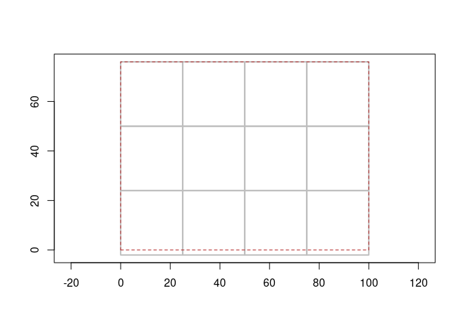
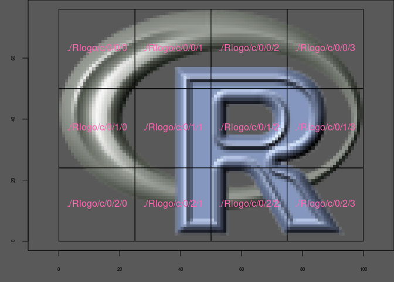
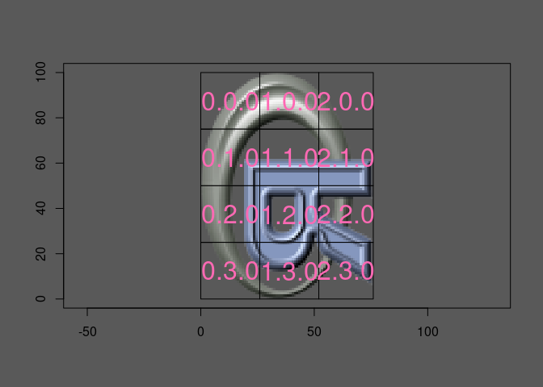

<!-- README.md is generated from README.Rmd. Please edit that file -->

# zerozarr

<!-- badges: start -->
<!-- badges: end -->

Here we cut a 3D array into 12 pieces, as a start at illustrating how
Zarr works.

Note that everything here will be wrong!! For a little while, I need to
step forward and backwards and look at everything carefully, but I want
it visible. Reach out if you’re interested, I don’t really think I can
write a Zarr implementation, but I can write a toy version with enough
chops to show what’s happening to folks who know R.

For now I’m sticking with 3D only because it’s easy to think about and
show easy illustrations, little chunks of RGB array so I know I have
something sensible and not just one of those sliding tile games.

You can watch me slowly increment this to something useful, I’m obsessed
with how cool Zarr is how it is composed of very general pieces. (And, I
know about {Rarr} and {pizarr} and GDAL multidim and stars and terra,
not wanting to undercut those this is just a learning exercise for now).

## TODO

- n-d tiling (generalize {grout})
- create json metadata
- create parquet metadata
- make an example that avoids degenerate coordinate referencing …
- encoding of chunks and read/write (we have write-via-GDAL and read via
  r-lib/archive, but only with NONE or GZIP compression)

Also maybe we can do the kerchunk referencing thing with some example
NetCDF files.

``` r
pngfile <- system.file("img", "Rlogo.png", package="png", mustWork = TRUE)

## we have this massive array
a <- fastpng::read_png(pngfile) * 255
mode(a) <- "integer"

dim(a)
#> [1]  76 100   4
```

``` r

## let's transpose and flip
a <- aperm(a, c(2, 1, 3))
## we have a tiling logic, let's go for 26x25x4

## hypertidy/grout on github
tiling <- grout::grout(dim(a)[1:2], blocksize = c(25, 26))
idx <- grout::tile_index(tiling)
idx
#> # A tibble: 12 × 11
#>     tile offset_x offset_y tile_col tile_row  ncol  nrow  xmin  xmax  ymin  ymax
#>    <int>    <dbl>    <dbl>    <dbl>    <dbl> <dbl> <dbl> <dbl> <dbl> <dbl> <dbl>
#>  1     1        0        0        1        1    25    26     0    25    50    76
#>  2     2       25        0        2        1    25    26    25    50    50    76
#>  3     3       50        0        3        1    25    26    50    75    50    76
#>  4     4       75        0        4        1    25    26    75   100    50    76
#>  5     5        0       26        1        2    25    26     0    25    24    50
#>  6     6       25       26        2        2    25    26    25    50    24    50
#>  7     7       50       26        3        2    25    26    50    75    24    50
#>  8     8       75       26        4        2    25    26    75   100    24    50
#>  9     9        0       52        1        3    25    24     0    25     0    24
#> 10    10       25       52        2        3    25    24    25    50     0    24
#> 11    11       50       52        3        3    25    24    50    75     0    24
#> 12    12       75       52        4        3    25    24    75   100     0    24
```

``` r

## we necessarily have some dangle, but we minimized it by choosing 26 not 25 for x
plot(tiling)
```



``` r

subset_3d_array <- function(x, offset, size) {
  ## offsets are zero-based
  l <- apply(rbind(offset + 1, size), 2, \(.x) seq(.x[1], length.out = .x[2]))
  x[l[[1]], l[[2]], l[[3]]]
}
## offset and size are the values in idx
str(subset_3d_array(a, c(0, 0, 0), c(26, 25, 4)))
#>  int [1:26, 1:25, 1:4] 0 0 0 0 0 0 0 0 0 0 ...
```

``` r
## our table idx describes the blocks, and their sizes (some are 26x25x4, some are 24x25x4)
split_array_blocks <- function(x, index, n3 = 4) {
  index$offset_z <- 0
  index$nz <- n3
  offsets <- lapply(purrr::transpose(index[c("offset_x", "offset_y", "offset_z")]), unlist)
  sizes <- lapply(purrr::transpose(index[c("ncol", "nrow", "nz")]), unlist)
  
  l <- vector("list", nrow(index))
  for (i in seq_along(offsets)) {
    l[[i]] <- subset_3d_array(x, offsets[[i]], sizes[[i]])
  }
  l
}

## this is the list of 0.0.0 0.1.0 1.0.0 1.1.0 ... 2.3.0 
## blocks, there are 3 tile columns, and 4 tile rows, and 1 tile in z
## so we go up as far as 2.3.0
listarr <- split_array_blocks(a, idx)

## ok so we're not n-dimension yet
chunk <- apply(cbind(0, idx$tile_row - 1, idx$tile_col - 1), 1, paste0, collapse = ".")
```

That indexing for the chunks 0.0.0 –\> 2.3.0 will hold the implicit
arrangement of the tiles.

We also have an xmin/xmax/ymin/ymax for each chunk, which is extremely
convenient.

``` r
mar <- c(2.8, 2.5, 0, 0)
cex.axis <- .5
op <- par(bg = "grey35", mar = mar, cex.axis = cex.axis)
plot(NA, xlab = "", ylab = "", asp = 1,
     xlim = c(0, max(idx$xmax)), ylim = c(0, max(idx$ymax)))
for (i in seq_along(listarr)) {
  ex <- unlist(idx[i, c("xmin", "xmax", "ymin", "ymax")])
  ximage::ximage(aperm(listarr[[i]], c(2, 1, 3)), ex, add = TRUE)
  p <- c(mean(ex[1:2]), mean(ex[3:4]))
  vaster::plot_extent(ex, add = TRUE)
  text(p[1], p[2], lab = chunk[i], cex = 2, col = "hotpink")

}
```


``` r
par(op)
```

Now, let’s create an actual ZARR in version 3 with GDAL, each block has
GZIP compression. We roundtrip our PNG file into a Zarr store, and plot
in the same way as we did with our manually split array above.

``` r
Rlogo.zarr <- file.path(tempdir(), "Rlogo.zarr")


block <- c(25, 26, 4)
blk <- paste0(rev(block), collapse= ",")


## COMPRESS = NONE/BLOSC/ZLIB/GZIP/LZMA/ZSTD/LZ4]  (no ZLIB, LZMA, ZSTD, LZ4 with ZARR_V3)
## filter ‘none’, ‘gzip’, ‘bzip2’, ‘compress’, ‘lzma’, ‘xz’, ‘uuencode’, ‘lzip’, ‘lrzip’, ‘lzop’, ‘grzip’, ‘lz4’, ‘zstd’.
system(glue::glue("
       gdal_translate {pngfile} {Rlogo.zarr} -of ZARR -co INTERLEAVE=BAND  -co COMPRESS=GZIP -co BLOCKSIZE={blk} -co FORMAT=ZARR_V3
"))


files <- fs::dir_ls(Rlogo.zarr,  recurse = TRUE,  type = "f")
keep <- grepl("^[0-9]", basename(files))

files <- file.path(dirname(files[keep]), basename(files[keep]))

op <- par(bg = "grey35", mar = mar, cex.axis = cex.axis)
## setup out plot as before
plot(NA, xlab = "", ylab = "", asp = 1,
     xlim = c(0, max(idx$xmax)), ylim = c(0, max(idx$ymax)))


## in this loop, 'ar' is now identical to the corresponding element in 
for (i in seq_along(files)) {
  ar <- readBin(archive::file_read(files[i], mode = "rb"), "integer", size = 1, n = prod(block), signed = FALSE)
  ex <- unlist(idx[i, c("xmin", "xmax", "ymin", "ymax")])
  ximage::ximage(aperm(array(ar, block), c(2, 1, 3)), ex, add = TRUE)
  p <- c(mean(ex[1:2]), mean(ex[3:4]))
  vaster::plot_extent(ex, add = TRUE)
  
  text(p[1], p[2], lab = gsub(file.path(dirname(Rlogo.zarr), "Rlogo.zarr"), ".", files[i]), cex = 1, col = "hotpink")
  
}
```



``` r
par(op)
```

Here we create another Zarr store from the PNG, but this time it’s done
with xarray.

We pass the PNG to xarray (via rioxarray ( via rasterio (via GDAL))) and
then use it to write to Zarr with whatever encoding it chooses.

``` r
library(reticulate)
xarray <- import("xarray")
zarr <- import("zarr")


pngfile <- system.file("img", "Rlogo.png", package="png", mustWork = TRUE)
ds <- xarray$open_dataset(pngfile, chunks = list(band = 4, y= 26, x = 25), mask_and_scale = FALSE)
compressor <-  zarr$GZip(level = 6L)
enc <- list(band_data =  list(compressor  = compressor))
unlink("xarray_gzip6.zarr/", recursive = TRUE)
ds$to_zarr("xarray_gzip6.zarr", encoding = enc)
#> <xarray.backends.zarr.ZarrStore object at 0x7fc9dcae6cc0>
```

``` r

## now let's read it
files <- fs::dir_ls("xarray_gzip6.zarr/band_data", recurse = TRUE, type = "f") 
files <- files[grepl("^[0-9]", basename(files))]
files
#> xarray_gzip6.zarr/band_data/0.0.0 xarray_gzip6.zarr/band_data/0.0.1 
#> xarray_gzip6.zarr/band_data/0.0.2 xarray_gzip6.zarr/band_data/0.0.3 
#> xarray_gzip6.zarr/band_data/0.1.0 xarray_gzip6.zarr/band_data/0.1.1 
#> xarray_gzip6.zarr/band_data/0.1.2 xarray_gzip6.zarr/band_data/0.1.3 
#> xarray_gzip6.zarr/band_data/0.2.0 xarray_gzip6.zarr/band_data/0.2.1 
#> xarray_gzip6.zarr/band_data/0.2.2 xarray_gzip6.zarr/band_data/0.2.3
```

And now set up a different kind of plot for each chunk.

``` r
block <- c(25, 26, 4)

par(mfrow = c(3, 4), mar = c(0.2, 0.2, 3, 0.2))
for (i in seq_along(files)) {
chunkvalues <- readBin(archive::file_read(files[i], mode = "rb"), 
        "integer", size = 1, signed = FALSE, n = prod(block))

ximage::ximage(aperm(array(chunkvalues, block), c(2, 1, 3)), axes = F, ylab = "", xlab = "")
title(basename(files[i]))
box(lty = 2)
#scan("", 1)
}
```



Let’s just check what the encoding of the Zarr is from different
directions.

``` r
jsonlite::fromJSON("xarray_gzip6.zarr/.zmetadata")$metadata[["band_data/.zarray"]]$compressor
#> $id
#> [1] "gzip"
#> 
#> $level
#> [1] 6
```

``` r

xarray$open_dataset("xarray_gzip6.zarr")$band_data$encoding$compressor
#> GZip(level=6)
```

## Code of Conduct

Please note that the zerozarr project is released with a [Contributor
Code of
Conduct](https://contributor-covenant.org/version/2/1/CODE_OF_CONDUCT.html).
By contributing to this project, you agree to abide by its terms.
