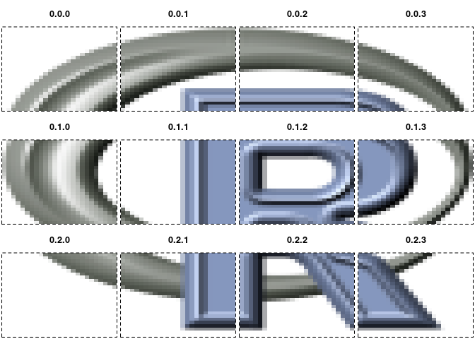

<!-- README.md is generated from README.Rmd. Please edit that file -->

# zerozarr

<!-- badges: start -->
<!-- badges: end -->

Here we cut a 3D array into 12 pieces, as a start at illustrating how
Zarr works.

Note that everything here will be wrong!! For a little while, I need to
step forward and backwards and look at everything carefully, but I want
it visible. Reach out if you’re interested, I don’t really think I can
write a Zarr implementation, but I can write a toy version with enough
chops to show what’s happening to folks who know R.

Also maybe we can do the kerchunk referencing thing with some example
NetCDF files.

For now I’m sticking with 3D only because it’s easy to think about and
show easy illustrations, little chunks of RGB array so I know I have
something sensible and not just one of those sliding tile games.

``` r
f <- system.file("img", "Rlogo.png", package="png", mustWork = TRUE)

## we have this massive array
a <- fastpng::read_png(f)
dim(a)
#> [1]  76 100   4
```

``` r

## we have a tiling logic, let's go for 26x25x4

## hypertidy/grout on github
tiling <- grout::grout(dim(a)[1:2], blocksize = c(26, 25))
idx <- grout::tile_index(tiling)
idx
#> # A tibble: 12 × 11
#>     tile offset_x offset_y tile_col tile_row  ncol  nrow  xmin  xmax  ymin  ymax
#>    <int>    <dbl>    <dbl>    <dbl>    <dbl> <dbl> <dbl> <dbl> <dbl> <dbl> <dbl>
#>  1     1        0        0        1        1    26    25     0    26    75   100
#>  2     2       26        0        2        1    26    25    26    52    75   100
#>  3     3       52        0        3        1    24    25    52    76    75   100
#>  4     4        0       25        1        2    26    25     0    26    50    75
#>  5     5       26       25        2        2    26    25    26    52    50    75
#>  6     6       52       25        3        2    24    25    52    76    50    75
#>  7     7        0       50        1        3    26    25     0    26    25    50
#>  8     8       26       50        2        3    26    25    26    52    25    50
#>  9     9       52       50        3        3    24    25    52    76    25    50
#> 10    10        0       75        1        4    26    25     0    26     0    25
#> 11    11       26       75        2        4    26    25    26    52     0    25
#> 12    12       52       75        3        4    24    25    52    76     0    25
```

``` r

## we necessarily have some dangle, but we minimized it by choosing 26 not 25 for x
plot(tiling)
```


``` r

subset_3d_array <- function(x, offset, size) {
  ## offsets are zero-based
  l <- apply(rbind(offset + 1, size), 2, \(.x) seq(.x[1], length.out = .x[2]))
  x[l[[1]], l[[2]], l[[3]]]
}
## offset and size are the values in idx
str(subset_3d_array(a, c(0, 0, 0), c(26, 25, 4)))
#>  num [1:26, 1:25, 1:4] 0 0 0 0 0 0 0 0 0 0 ...
```

``` r
## our table idx describes the blocks, and their sizes (some are 26x25x4, some are 24x25x4)
split_array_blocks <- function(x, index, n3 = 4) {
  index$offset_z <- 0
  index$nz <- n3
  offsets <- lapply(purrr::transpose(index[c("offset_x", "offset_y", "offset_z")]), unlist)
  sizes <- lapply(purrr::transpose(index[c("ncol", "nrow", "nz")]), unlist)
  
  l <- vector("list", nrow(index))
  for (i in seq_along(offsets)) {
    l[[i]] <- subset_3d_array(x, offsets[[i]], sizes[[i]])
  }
  l
}

## this is the list of 0.0.0 0.1.0 1.0.0 1.1.0 ... 2.3.0 
## blocks, there are 3 tile columns, and 4 tile rows, and 1 tile in z
## so we go up as far as 2.3.0
l <- split_array_blocks(a, idx)

## ok so we're not n-dimension yet
chunk <- apply(cbind(idx$tile_col - 1, idx$tile_row - 1, 0), 1, paste0, collapse = ".")
```

That indexing for the chunks 0.0.0 –\> 2.3.0 will hold the implicit
arrangement of the tiles.

We also have an xmin/xmax/ymin/ymax for each chunk, which is extremely
convenient.

``` r
par(bg = "grey35")
plot(NA, xlab = "", ylab = "", asp = 1,
     xlim = c(0, max(idx$xmax)), ylim = c(0, max(idx$ymax)))
for (i in seq_along(l)) {
  ex <- unlist(idx[i, c("xmin", "xmax", "ymin", "ymax")])
  ximage::ximage(aperm(l[[i]], c(2, 1, 3)), ex, add = TRUE)
  p <- c(mean(ex[1:2]), mean(ex[3:4]))
  vaster::plot_extent(ex, add = TRUE)
  text(p[1], p[2], lab = chunk[i], cex = 2, col = "hotpink")

}
```


